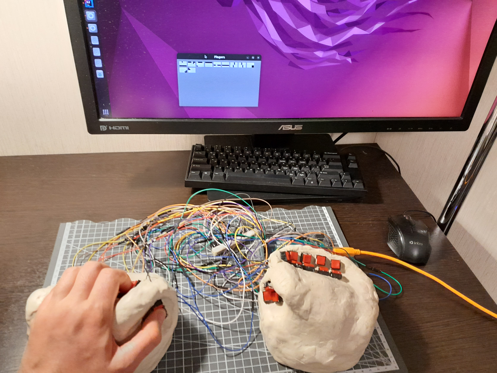

# Язык пальцев

Одной рукой человек вводит 12 бит. Двумя руками вместе - 24 бита. 2 в 24 степени даЁт 16.777.216 сочетаний.

Отображение слова в виде кода состоит из прямоугольника, который разделЁн на 24 клетки, расположенных в четырЁх строках. Клетки образуют матрицу 4х6.

Ввод на сенсорном дисплее осуществляется пальцем, которым водят по матрице.

Один код соответствует слову. Одно нажатие - одно слово. Окончание ввода знака определяется в момент, когда ни одна кнопка не нажата.

Возможно закрепить простые комбинации за буквами алфавита. В этом режиме устройство выполняет функции традиционной клавиатуры.

Добавление специального кода переключения раскладок позволяет выполнять ввод на нескольких языках. Например, можно включить раскладку для прямого ввода UTF 16.

